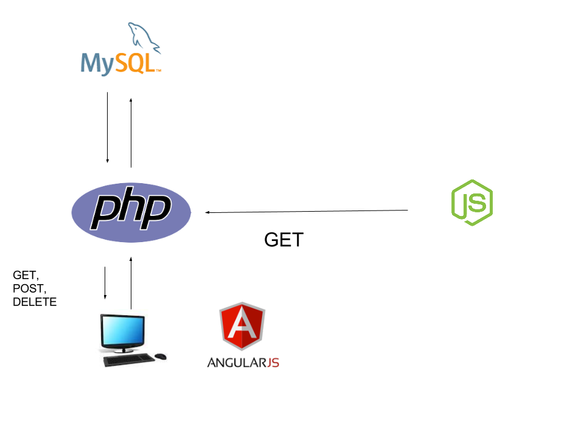

# Web-server-languages-SmartDash
##Проект по Уеб сървърни езици

Проекта има за цел да представи комуникация между apache php уеб приложение и nodeJS уеб API.

Php приложението праща GET заявки до nodeAPI-то и резултатите ги записва в база данни , след което ги визуализира в графика. 

За да стартирате проекра трябва да стартирате следмите команди в папката на проекта

```
sudo php composer.phar
cd public/app/
bower install

```


